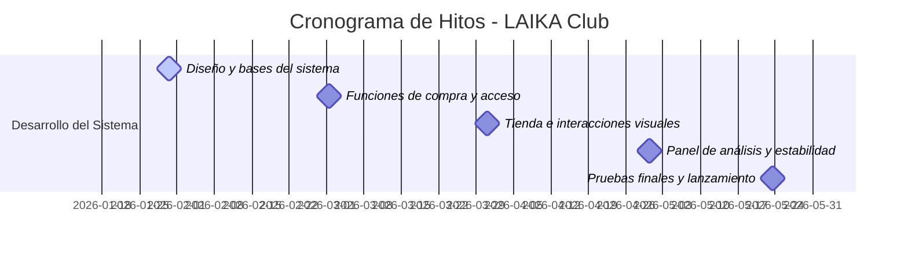
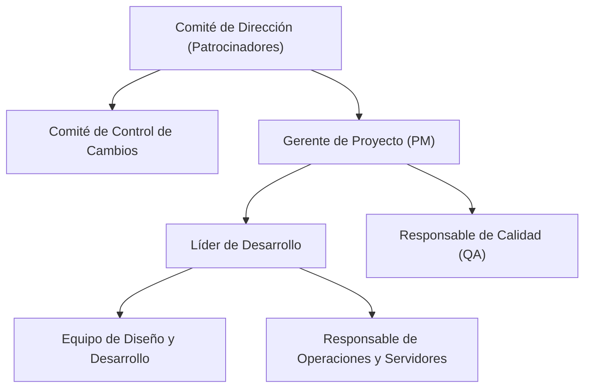

# Acta de Constitución del Proyecto

| **Proyecto** | LAIKA Club - Plataforma de Gestión de Eventos y Venta de Boletos |
| :--- | :--- |
| **Código** | LC-2026-V3 |
| **Fecha de Inicio** | 15 de Enero de 2026 |
| **Fecha de Aprobación** | 20 de Enero de 2026 |

---

## 1. Racionalidad y Propósito del Proyecto

### Problema a Resolver
La industria de la organización de eventos en vivo y la venta de boletos suele enfrentarse a diversos obstáculos debido al uso de plataformas tradicionales centralizadas. Los principales inconvenientes identificados son:
- Caídas y lentitud en los procesos de compra digital durante eventos de gran convocatoria.
- Falta de transparencia en la distribución y selección de los asientos.
- Elevadas comisiones por intermediación, lo cual incrementa el costo final tanto para los organizadores de eventos como para los asistentes.
- Dificultades para que los organizadores vendan productos oficiales (merchandising) directamente junto con los boletos.
- Herramientas de análisis e información insuficientes para que los organizadores evalúen las ventas y el comportamiento del público en tiempo real.

### Propósito del Proyecto
El proyecto **LAIKA Club** nace con el propósito de crear una plataforma integral, robusta y fácil de usar para cualquier persona u organización que desee realizar eventos y vender boletos. La meta es ofrecer una herramienta directa que conecte a los organizadores con su público, reduciendo costos por intermediación y ofreciendo una experiencia de compra interactiva y atractiva (a través de dinámicas de asignación de asientos aleatorios y representaciones visuales de los boletos emitidos). Además, busca integrar la venta directa de productos promocionales y ofrecer a los creadores de eventos paneles de estadísticas en tres dimensiones para comprender mejor el éxito de sus actividades y tomar decisiones comerciales informadas de forma sencilla.

---

## 2. Objetivos del Proyecto (SMART)

*   **Específico (Specific):** Diseñar y construir la plataforma digital **LAIKA Club**, dotándola de una interfaz moderna y atractiva para los usuarios, un sistema de procesamiento de compras rápido, un módulo de venta de artículos promocionales y herramientas visuales para el análisis del rendimiento de los eventos.
*   **Medible (Measurable):** 
    *   Soportar el procesamiento de al menos **10,000 transacciones de compra por minuto** sin interrupciones ni degradación del servicio.
    *   Garantizar que el tiempo que tarda el sistema en responder a las acciones de los usuarios en pantallas clave sea menor a **0.2 segundos**.
    *   Mantener la plataforma activa y en funcionamiento el **99.9%** del tiempo durante los picos de venta.
*   **Alcanzable (Achievable):** Construir la solución utilizando herramientas de desarrollo web de última generación con las que el equipo ya tiene amplia experiencia y que garantizan estabilidad y seguridad de la información.
*   **Relevante (Relevant):** Disminuir en un **15%** los costos por gestión de venta para los organizadores de eventos en comparación con servicios tradicionales, e incrementar en un **25%** la venta combinada de boletos y artículos oficiales del evento.
*   **Límite de Tiempo (Time-bound):** Completar todas las etapas de diseño, desarrollo, pruebas y puesta en marcha oficial del sistema en un periodo de **5 meses** (concluyendo a finales de mayo de 2026).

---

## 3. Estrategia del Proyecto (Modelo de Intervención)

El proyecto se gestionará bajo un enfoque de desarrollo ágil y por etapas, permitiendo construir y revisar el sistema de manera incremental. Se priorizará el diseño de una estructura digital estable, donde cada función (como la venta de boletos, el catálogo de productos o el análisis estadístico) opere de forma independiente para evitar que un inconveniente en un área afecte al resto del sistema.

### Alcance y Límites

#### Entregables Principales (Dentro de Alcance)
1.  **Interfaz de Usuario Premium:** Portal web de aspecto visual sofisticado e intuitivo, adaptable tanto a computadoras de escritorio como a teléfonos móviles, con transiciones y animaciones fluidas.
2.  **Sistema de Compra Ágil (Modo Invitado):** Flujo de pago optimizado que permite a los compradores adquirir sus entradas de manera rápida sin la obligación de crear una cuenta o registrar un usuario.
3.  **Dinámica de Asiento Sorpresa ("Lucky Seat Roulette"):** Función interactiva y recreativa que permite a los usuarios seleccionar asientos al azar bajo condiciones especiales de precio.
4.  **Simulación Visual de Boleto Digital:** Una animación que simula en pantalla la impresión y emisión formal de la entrada digital para mejorar la experiencia del cliente al finalizar su compra.
5.  **Tienda de Artículos Promocionales Integrada:** Módulo para que los creadores de eventos ofrezcan camisetas, discos u otros productos oficiales dentro de la misma página del evento, incluyendo herramientas para gestionar la disponibilidad de dichos artículos.
6.  **Panel de Estadísticas Visuales en 3D:** Gráficos e indicadores interactivos en tres dimensiones para que los organizadores analicen de manera sencilla el volumen de ventas, la asistencia y el comportamiento de sus clientes.
7.  **Sistema de Prevención y Auto-Recuperación de Fallas:** Mecanismos automáticos que monitorean la salud de la plataforma y resuelven de forma inmediata inconvenientes de conexión o almacenamiento de datos sin interrumpir el servicio.
8.  **Programa de Recompensas y Fidelización:** Módulo que asigna de manera automática reconocimientos y beneficios a los compradores recurrentes para fomentar su lealtad.

#### Exclusiones y Límites de Alcance
*   **Integración con Pasarelas de Cobro Real Bancario:** La plataforma incluirá una simulación completa y segura de transacciones financieras para validación del sistema, pero no conectará con sistemas reales de cobro bancario en esta versión.
*   **Aplicación Móvil para Tiendas (App Store/Google Play):** La herramienta funcionará directamente a través del navegador de internet en cualquier dispositivo móvil; no se desarrollarán aplicaciones descargables en tiendas oficiales.
*   **Taquilla Presencial y Lectores Físicos:** El alcance se limita al canal de venta digital autogestionado por internet, excluyendo el soporte a terminales de venta física en establecimientos o impresión de boletos térmicos en ventanilla.

### Cronograma Resumido de Hitos

*   **Hito 1 (15 de Febrero de 2026):** Definición de la estructura visual del sitio, configuración inicial del entorno de trabajo y diseño del modelo para almacenar la información de los eventos.
*   **Hito 2 (15 de Marzo de 2026):** Flujo de compra básico de boletos activo, inicio de sesión seguro para usuarios y almacenamiento de entradas emitidas.
*   **Hito 3 (15 de Abril de 2026):** Tienda de artículos promocionales operativa, animación de boleto digital finalizada y dinámica de asiento sorpresa lista para usarse.
*   **Hito 4 (15 de Mayo de 2026):** Panel de estadísticas en 3D para organizadores implementado y sistema de prevención ante caídas en el almacenamiento de datos en funcionamiento.
*   **Hito 5 (31 de Mayo de 2026):** Pruebas finales de resistencia bajo alta demanda de usuarios, corrección de detalles y apertura oficial de la plataforma al público.

---

## 4. Presupuesto Resumido

El presupuesto total aprobado para el desarrollo de la plataforma asciende a **$140,000 USD**, distribuido de la siguiente manera:

| Categoría | Concepto | Costo Estimado (USD) |
| :--- | :--- | :--- |
| **Equipo de Trabajo** | Dedicación del personal de diseño y desarrollo (6 profesionales a tiempo completo por 5 meses) | $120,000 USD |
| **Infraestructura y Licencias** | Alojamiento y almacenamiento en la nube, adquisición de dominios y seguridad digital | $15,000 USD |
| **Reserva para Contingencias** | Fondo destinado a atender cualquier desviación o imprevisto durante la ejecución (5%) | $5,000 USD |
| **Total** | **Presupuesto del Proyecto** | **$140,000 USD** |

---

## 5. Riesgos, Supuestos y Restricciones

### Riesgos de Alto Nivel
1.  **Dificultad en la rapidez de los reportes:** Lentitud en la actualización de los gráficos en 3D cuando haya miles de ventas simultáneas.
    *   *Mitigación:* Configurar el sistema para que procese los datos de forma progresiva en segundo plano sin interrumpir la experiencia de compra del usuario.
2.  **Seguridad en las entradas:** Riesgo de falsificación o copias no autorizadas de las entradas digitales de los usuarios.
    *   *Mitigación:* Generar códigos QR con firmas de seguridad únicas que solo puedan ser validados por el sistema autorizado de forma instantánea.

### Supuestos
*   Los servicios de almacenamiento y servidores en la nube contratados mantendrán un funcionamiento continuo y sin interrupciones.
*   El equipo de diseño y desarrollo posee el conocimiento necesario para resolver los desafíos de interactividad visual planteados.
*   Las herramientas internas para configurar y probar el sistema mantendrán compatibilidad a lo largo de todas las fases.

### Restricciones
*   **Presupuesto:** Los costos no pueden superar de ninguna manera el presupuesto límite asignado de $140,000 USD.
*   **Tiempo de entrega:** La fecha límite del 31 de mayo de 2026 es fija y no negociable debido a acuerdos previos con organizadores para el lanzamiento de sus eventos.

---

## 6. Estructura de Gobernabilidad

El objetivo de esta gobernabilidad es definir quién toma las decisiones clave y cómo se comunica el avance del proyecto.

1.  **Comité de Dirección (Patrocinadores):**
    *   *Responsabilidad:* Aprobación del financiamiento, alineación de la plataforma con los objetivos del negocio y toma de decisiones ante variaciones de presupuesto superiores al 10% o cambios en las fechas límite.
2.  **Comité de Control de Cambios:**
    *   *Responsabilidad:* Evaluar, aprobar o rechazar modificaciones en las características o tiempos del proyecto. Está integrado por el Gerente de Proyecto, un patrocinador de negocio y el Líder de Desarrollo.
3.  **Gerente de Proyecto:**
    *   *Responsabilidad:* Coordinación diaria del trabajo, seguimiento al cumplimiento de fechas, resolución de impedimentos y reporte de avances periódicos al Comité de Dirección.
4.  **Líder de Desarrollo:**
    *   *Responsabilidad:* Supervisar el buen diseño y funcionamiento de la plataforma, coordinar al equipo de programación y garantizar que la información se almacene de forma óptima y segura.
5.  **Equipo de Diseño, Desarrollo y Calidad:**
    *   *Responsabilidad:* Crear la interfaz gráfica, programar las funciones de la plataforma, verificar que todo funcione sin errores y que sea intuitivo para el usuario.

---

## 7. Control de Cambios

Para mantener el control sobre el alcance, el costo y el cronograma, cualquier sugerencia de modificación deberá seguir este procedimiento:

1.  **Solicitud:** Quien proponga un cambio debe completar un reporte describiendo la modificación propuesta y explicando su beneficio para los usuarios o el negocio.
2.  **Evaluación:** El Gerente de Proyecto y el Líder de Desarrollo analizarán si el cambio propuesto altera los tiempos de entrega, aumenta los costos o requiere más personal.
3.  **Clasificación:**
    *   *Cambios de bajo impacto:* Modificaciones sencillas que no alteran el presupuesto ni el lanzamiento del sistema. Pueden ser aprobados por el Gerente de Proyecto.
    *   *Cambios de alto impacto:* Modificaciones que añaden nuevas secciones complejas, alteran las fechas de hitos o incrementan el costo. Deben ser aprobados formalmente por el Comité de Control de Cambios.
4.  **Registro y Aplicación:** Los cambios aprobados se documentarán en un registro de control histórico y se integrarán al plan de trabajo oficial.

---

## 8. Aprobado por

Con su firma electrónica, las siguientes personas autorizan formalmente el inicio del proyecto LAIKA Club:

| Nombre y Apellido | Cargo / Rol | Firma / Autorización |
| :--- | :--- | :--- |
| **Ing. Alejandro Ruiz** | Director General / Patrocinador Principal | *Aprobado digitalmente* |
| **Ing. Sofía Mendoza** | Directora de Tecnología | *Aprobado digitalmente* |
| **Mtr. Esteban Ortega** | Gerente del Proyecto | *Aprobado digitalmente* |
